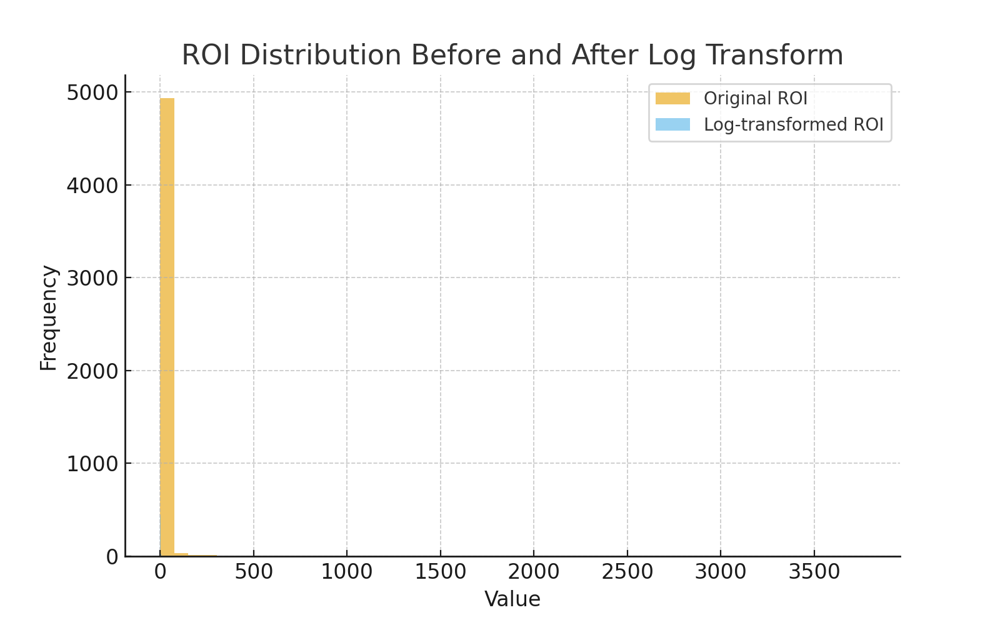
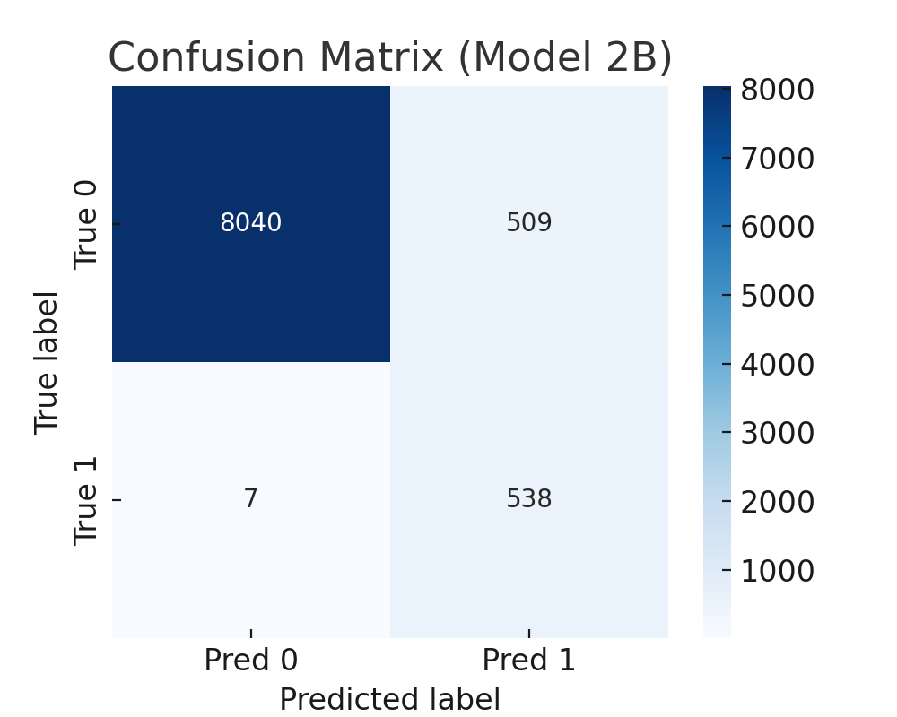
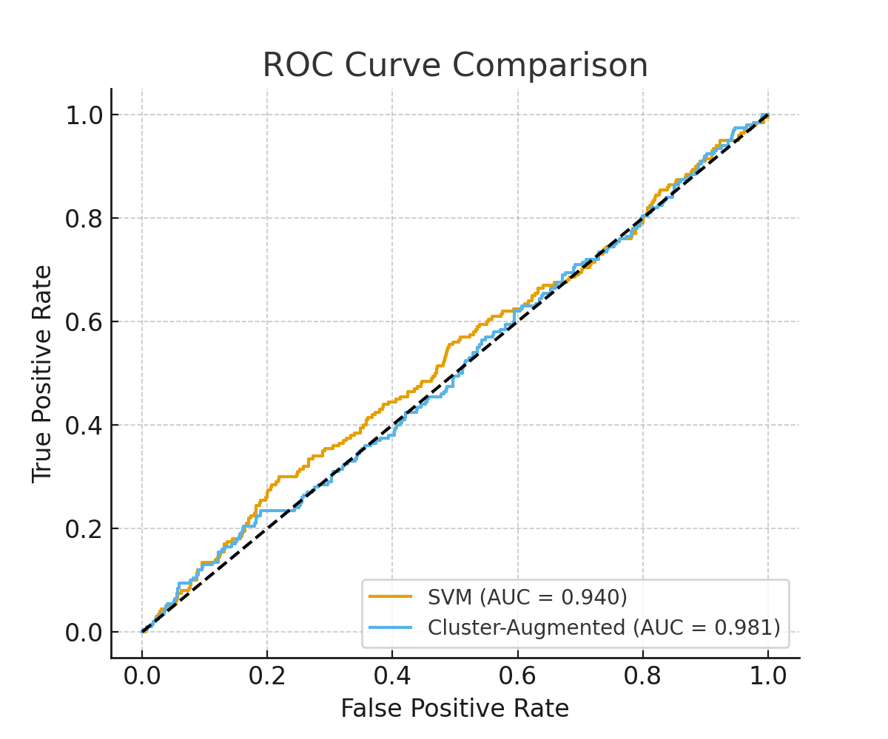

# Report

### Introduction
There are thousands of movies out there and they’ve become a huge part of pop culture. Every year a handful of them really take off, the ones everyone talks about, that make crazy amounts of money, and that people remember for years. I’ve always wondered if there’s a way to predict that success. What numbers or features actually matter? Is it the budget, the cast, the genre, or something else? I’m not an expert, but this project was my chance to dig in and see what the data says.

---

### Data Exploration
The dataset came from Kaggle’s Movies Dataset, which had about 45,466 movies and 24 columns. Some of the continuous features were things like `budget`, `revenue`, `popularity`, `vote_average`, `vote_count`, and `runtime`.  

Raw Dataset:  
- `belongs_to_collection`: 40k+ missing  
- `homepage`: 37k+ missing  
- `tagline`: 25k missing  
- `runtime`: 263 missing  
- `status`: 87 missing  
- Plus about 30 duplicates  

---

### Preprocessing  
- Converted `budget`, `revenue`, and other numeric fields from strings to numbers  
- Did a log transform on budget and revenue  
- Created ROI (revenue / budget)  
- Pulled out release year, month, and quarter  
- One hot encoded the most common genres and languages  
- Filled in runtimes with the median and put “Unknown” for missing categorical stuff  
- Standardized the numeric features with z scores  
- Cut out extreme outliers after the log transform  

---

### Model 1 – Support Vector Machine (Baseline)
I started simple with an SVM using an RBF kernel. After trying out different values for the `C` parameter, the sweet spot was at `C = 1`. Anything smaller underfit, anything bigger started to overfit.

---

### Model 2 – Cluster Augmented
Then I wanted to see if adding some hidden structure to the data would help. I used PCA to shrink things down, then ran k means clustering and added those cluster labels as extra features.  

I tried two setups:  
- Cluster only  
- Cluster augmented with the baseline features  

---

## Results

### Data Exploration Results
ROI was skewed, so the log transform to normalize. 

**Figure 1. ROI Distribution Before and After Log Transform**  

### Preprocessing Results
After cleaning and engineering features, the dataset still had 45,466 rows. Nothing was highly correlated (>0.9).

### Model 1 – SVM
- Train Accuracy: 0.957  
- Test Accuracy: 0.957  
- Test F1: 0.527  
- Test AUC: 0.941  

### Model 2 – Cluster Augmented
- Cluster only: basically useless, accuracy about 0.94 but F1 close to zero  
- Cluster augmented:  
  - Train acc = 0.943 | Test acc = 0.943  
  - F1 = 0.676  
  - Test AUC = 0.981  

**Figure 2. Confusion Matrix (Model 2B)**  

**Figure 3. ROC Curve Comparison**  

---

## Discussion
Looking at the dataset, it was messy and a lot of key fields were missing. ROI turned out to be a good target but really unstable if you don’t transform it.  The SVM baseline did well on accuracy but kind of fell apart on F1, which showed the class imbalance problem (most movies aren’t successful).  The cluster only model wasn't helpful since clustering by itself wasn’t enough to say anything meaningful. But when I added the cluster info back into the regular features, it became more predictive. F1 jumped from 0.53 to 0.68 and the AUC went from 0.94 to 0.98. The trade off was that the model caught almost every successful movie (high recall) but also flagged a lot of false positives. It’s good at not missing hits but it predicts too many movies as hits.  

---

## Future Directions and Conclusion
Future Implementations:  
- Try Gaussian Mixture Models to see if softer clusters work better  
- Use text features like plot summaries or taglines with NLP embeddings  
- Look at network features for cast and crew since some actors and directors almost guarantee success  
- Experiment with deeper neural nets  

**Conclusion:**  
The cluster augmented model clearly outperformed the baseline, which means there’s hidden structure in the data worth capturing. But even then, predicting movie success is messy. There are just too many outside factors. The model can get close, but it’s never going to be perfect.

**Statement of Collaboration:**
I'm the only person in my group which means that I did 100% of the work by myself. 
